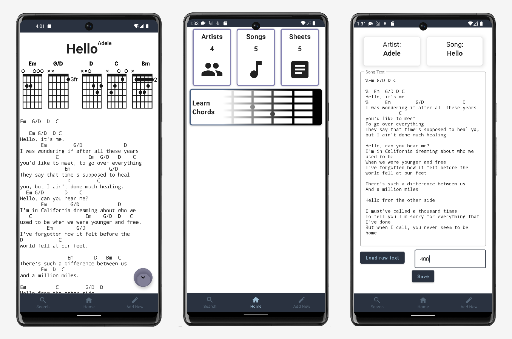
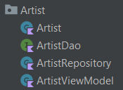

# Acorn - Gitarren Chordsheet Katalog

Acorn ist ein Katalog für Chordsheets. Songs können hinzugefügt werden, welche dann mit Akkorden vershehen werden können.



## Aufbau Frontend (Android)

Die einzelnen Entities werden in ihre eigenen Ordner gegeben und mit den Files gruppiert, die mit dem Entity zusammenhängen.



Im Bild gezeigt werden die Files für die Entity _Artist_. Der Ordner enthält die Klassen/Interfaces:


* Artist: Eine _data class_ für die Persistierung in die RoomDB
* ArtistDAO: Ein Interface zur Kommunikation mit der Datenbank (Genaueres im Kapitel [DAO](#dao))
* ArtistRepository: Wird für die Kommunikation mit dem DAO benutzt, und ruft _coroutines_ auf (Erklärung im Kapitel [Repositories](#coroutines)) 
* ArtistViewModel: Für die Aufrufe der REST-API mittels Retrofit

### DAO

Die DAOs werden mit der Annotation _@Dao_ gekennzeichnet und sind Interfaces. Sie werden dazu benutzt um mit der RoomDB zu Kommunizieren und Queries an die Datenbank zu senden.
Zugegriffen wird auf die Datenbank mit [SQLite](https://sqlite.org/index.html).
Für insert Statements muss eine funktion, welche das Objekt für den Insert übergeben bekommt, mit _@Insert_ annotiert werden. Es sollte auch eine _onConflict_ Strategie angegeben werden, um der Datenbank zu sagen, wie sie mit Objekten mit zum Beispiel der gleichen Id umgehen soll.
Alle Abfragen sind Funktionen, mit, optional Parametern für die Query als Übergabewert, und einem Rückgabewert. Diese Funktionen werden mit _@Query_ annotiert, mit einer SQLite Query in den Klammern der Annotation.

Beispiel:
````agsl
@Query("SELECT * FROM artist_table ORDER BY artist_id ASC")
    fun readAllData(): LiveData<List<Artist>>
````

### Repository

Repositories werden dazu genutzt, um DAOs und deren Methoden aufzurufen. Für Listen werden _LiveData_ oder _MutableLiveData_ benutzt. LiveData wird benutzt, wenn daten nicht direkt verändert werden sollen, wenn Daten nach dem Laden verändert werden dürfen, muss MutableLiveData genutzt werden. Beide dieser Klassen werden als Observables in einem bestimmten Livecycle genutzt werden.

In den Repositories werden auch Coroutines erstellt und aufgerufen. Der Scope wird auf dem Main-Thread ausgeführt. Die restlichen Coroutinen werden in einem separaten Thread gestartet. 

Aufruf Beispiel:

````agsl
fun findSheet(id: Long){
        coroutineScope.launch(Dispatchers.Main) {
            searchResults.value = asyncFind(id).await()
        }
    }

private fun asyncFind(id: Long): Deferred<List<Sheet>?> =
    coroutineScope.async(Dispatchers.IO){
        return@async sheetDao.getSheetsForSongID(id)
    }
````

### ViewModels

Die ViewModels werden nur dazu genutzt, um die [API](#api-service)-Calls an das Backend zu machen. Die Aufrufe werden im _ViewModelScope_ gemacht. Der Aufruf erfolgt über eine _Instanz_ des API Services. Des gesamte Rückgabewert wird in eine Liste gespeichert.

#### ViewModelFactory

Die ViewModels werden mittels Factory-Ansatz erstellt. Die ViewModelProvider Klasse wird von LiveCycles zur Verfügung gestellt, womit die Factory erstellt werden kann.

```
class MainViewModelFactory(val application: Application) :
    ViewModelProvider.Factory {
    override fun <T : ViewModel> create(modelClass: Class<T>): T {
        return MainViewModel(application) as T
    }
}
```

### RoomDB

Für die Room Datenbank muss eine eigene abstrakte Klasse erstellt werden, welche von RoomDatabase erbt. Hier werden auch die DAOs als abstrakte funktionen erstellt. Als einziges Objekt wird ein _companion object_ erstellt. Companion Objects sind Objekte, für welche neue Instanzen ohne dem new _Keyword_ erstellt werden können .
Die Datenbankinstanz wird mit @Volatile annotiert, welches bewirkt, dass Änderungen der Instanz sofort für andere Threads sichtbar wird (o.a. Andere Threads erstellen keine neue Instanz, wenn es bereits eine gibt).

Beim Erstellen der Instanz wird die methode in einem _Synchronized lock_ aufgerufen, andere Threads können die Methode nicht aufrufe, wenn sie bereits von einem Thread besetzt wird. 

### Api-Service

Der API-Service wird mit Retrofit implementiert. Die Instanz ist wieder ein _companion object_ um die REST-Methoden der übergeordneten Klasse verwenden zu können. Für REST-Services auf dem LocalHost muss auf die Url : http://10.0.2.2:8080 verwiesen werden. Um auf Services aus dem Web zugreifen zu können, muss im Manifest die _Permission_ 
``    
<uses-permission android:name="android.permission.INTERNET" />
``
eingefügt werden.

### Navigation

In der Klasse _Screen_ werden die Pfade für die einzelnen Screens als _Screen_ angelegt. 

````agsl
object Home: Screen(route = "home_screen")
````

Statische Pfade können einfach als string eingetragen werden. Für Pfade mit Argumenten, empfiehlt sich, eine Funktion, zur übergabe der Argumente zu machen.

#### NavGraph

In dem NavGraph File ist eine Funktion, welche zur Navigation dient. Dazu muss ein _NavController_ übergeben werden, welcher vom NavHost benutzt wird, um die Navigation durchzuführen. 

````aidl
NavHost(
        navController = navController,
        startDestination = Screen.Home.route
    )
````

Im Körper der NavHost Funktion werden Composables mit der zuvor gespeicherten Route aufgerufen, welche mittels ViewModelFactories die benötigten ViewModels für den jeweiligen Screen erstellen. Die Screens werden in eigenen Composables erstellt, den Setup-Funktionen.

## Nützliche Ressourcen Jetpack Compose
<details>
  <summary>Websites</summary>
  
* [Textfield und KeyboardActions](https://semicolonspace.com/jetpack-compose-textfield/)
* [Retrofit und RecylerView](https://www.howtodoandroid.com/jetpack-compose-retrofit-recyclerview/)
* [RoomDB-Fragments](https://htl-leonding-college.github.io/android-classroom-course/room-tutorial.html)
* [RoomDB-Jetpack-Compose](https://www.answertopia.com/jetpack-compose/a-jetpack-compose-room-database-and-repository-tutorial/)

</details>

<details>
  <summary>Videos</summary>
  
* Navigation
  * [Basic Navigation](https://youtu.be/doGsRC2J1Fc)
  * [Sending Arguments between Screens](https://youtu.be/doGsRC2J1Fc)
* AppBars
  * [Bottom Navigation](https://youtu.be/gg-KBGH9T8s)
  * [Search Widget](https://youtu.be/3oXBnM6fZj0)
</details>
